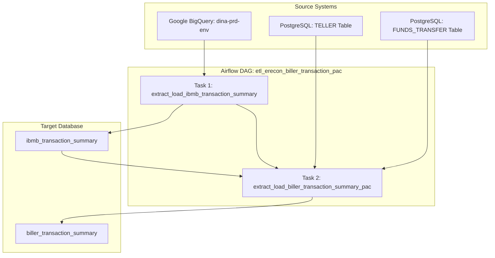

## Project Name: E-Reconciliation Biller Transaction (PAC) ETL Pipeline
**Document Version:** 1.0  
**Status:** Draft  
**Target File:** [etl_erecon_biller_transaction_pac.py](../etl_erecon_biller_transaction_pac.py)  
**Date:** 2026-07-21  

---
## 1. Introduction & Overview
This document specifies the technical design, system flow, data schemas, and SQL queries used in the Airflow DAG `etl_erecon_biller_transaction_pac`.

The DAG consolidates daily transactions related to partner code `PAC` (PT Point Alternatif Cerdas) into the PostgreSQL target database `db_erecon` for reconciliation.

---

## 2. Technical System Architecture



---

## 3. DAG Settings and Parameters

| Parameter | Configuration / Value | Description |
|-----------|------------------------|-------------|
| **DAG ID** | `etl_erecon_biller_transaction_pac` | Airflow identifier for the pipeline |
| **Schedule** | `0 22 * * *` | Runs daily at 22:00 UTC (05:00 WIB next day) |
| **Start Date** | `2026-05-05` | Start boundary for the scheduler |
| **Catchup** | `False` | Disables automated backfilling for missing runs |
| **Retries** | `2` | Number of attempts in case of failure |
| **Retry Delay** | `5 minutes` | Inter-retry wait time |
| **Connections Used** | `google_cloud_default` (BigQuery), `db_erecon` (PostgreSQL) | Airflow Connection IDs |
| **Parameters** | `business_date`: String (Format: `YYYY-MM-DD`, Default: `""`) | Optional override parameter for backfilling |

---

## 4. Helper Functions

### 4.1 Date Resolution (`resolve_business_date`)
If `business_date` is not supplied via the manual trigger parameters, it defaults to:
$$\text{business\_date} = (\text{Current UTC Time} + 7\text{ hours}) - 1\text{ day}$$
This maps to the previous business day in Western Indonesia Time (WIB, UTC+7).

### 4.2 Date Parsing (`parse_transaction_date`)
Parses BigQuery timestamp strings or datetime objects into a timezone-naive `datetime` object suitable for PostgreSQL. It supports the following formats:
* `%Y-%m-%d %H:%M:%S.%f UTC`
* `%Y-%m-%d %H:%M:%S UTC`
* `%Y-%m-%d %H:%M:%S.%f`
* `%Y-%m-%d %H:%M:%S`
* `%Y-%m-%dT%H:%M:%S.%f`
* `%Y-%m-%dT%H:%M:%S`
* `%Y-%m-%d`

---

## 5. Detailed Task Specifications

### 5.1 Task 1: `extract_load_ibmb_transaction_summary`
Extracts digital channel transactions from GCP BigQuery, performs business calculations, and loads them into PostgreSQL `ibmb_transaction_summary`.

#### A. Source Query (BigQuery)
```sql
SELECT
  t.id,
  t.transaction_date,
  t.delivery_channel,
  t.reference_number,
  t.from_account_number,
  t.translation_code,
  t.customer_reference,
  CASE
    WHEN LOWER(t.translation_code) = 'q1' AND t.status != 'SUCCEED'
      THEN (t.transaction_amount - t.fee)
    WHEN LOWER(t.translation_code) = 'b4' AND t.biller_name IN ('PDAM Surabaya')
      THEN CAST(JSON_VALUE(td.transaction_data, '$.amount') AS NUMERIC)
    WHEN LOWER(t.translation_code) = 'b4' AND t.biller_name IN ('PDAM Palyja Jakarta', 'PDAM Aetra Tangerang')
      THEN (CAST(JSON_VALUE(td.transaction_data, '$.premiumAmount') AS NUMERIC) + CAST(JSON_VALUE(td.transaction_data, '$.penalty') AS NUMERIC))
    ELSE t.transaction_amount
  END AS transaction_amount,
  t.fee,
  t.biller_id,
  t.status,
  t.biller_name
FROM `dina-prd-env.bina_pac_channel_ebanking.ebanking_t_transaction` t
INNER JOIN `dina-prd-env.bina_pac_channel_ebanking.ebanking_m_customer` c
  ON c.id = t.m_customer_id
LEFT JOIN `dina-prd-env.bina_pac_channel_ebanking.ebanking_t_transaction_data` td
  ON td.t_transaction_id = t.id
WHERE DATE(t.transaction_date) = '{business_date}' 
  AND t.translation_code IN ('80', '81', '88', '91', '92', '82', 'G8', 'X1', 'X3', 'X4', 'X5');
```

> [!NOTE]
> **Observation/Constraint:** The `CASE WHEN` logic in the SELECT query contains checks for `LOWER(t.translation_code) = 'q1'` and `'b4'`. However, the `WHERE` clause filters for codes `('80', '81', '88', '91', '92', '82', 'G8', 'X1', 'X3', 'X4', 'X5')`. Therefore, `q1` and `b4` transactions will currently not be returned by this query.

#### B. Transformation Rules
1. **Discard Missing IDs:** Drop rows missing `reference_number` or `id`.
2. **Discard Invalid Dates:** Parse `transaction_date` using `parse_transaction_date`. Drop rows if parsing fails.
3. **Parse & Calculate Amounts:**
   * Convert `transaction_amount` (mapped to `base_amount`) and `fee` (mapped to `fee_admin`) to floats.
   * Calculate: `total_amount = base_amount + fee_admin`.
4. **Biller Code Clean-up:** Strip whitespace from `biller_id`. Set to `None`/`NULL` if empty.
5. **Settlement Date mapping:** Set `settlement_date` equal to the parsed `transaction_date`'s date component.

#### C. Target Table Mapping (`ibmb_transaction_summary`)
| Target Column | Source Field / Logic | Data Type |
|---------------|----------------------|-----------|
| `journal_source` | Hardcoded `'IBMB'` | VARCHAR |
| `journal_reference_id` | `reference_number` | VARCHAR |
| `internal_reference` | `id` (transaction ID) | VARCHAR |
| `partner_reference` | `reference_number` | VARCHAR |
| `transaction_type` | `translation_code` | VARCHAR |
| `source_account` | `from_account_number` | VARCHAR |
| `destination_account`| `None` / `NULL` | VARCHAR |
| `biller_code` | Sanitized `biller_id` | VARCHAR |
| `customer_reference` | `customer_reference` | VARCHAR |
| `base_amount` | Calculated base amount | NUMERIC |
| `fee_admin` | `fee` | NUMERIC |
| `total_amount` | `base_amount + fee_admin` | NUMERIC |
| `transaction_date` | Parsed `transaction_date` | TIMESTAMP |
| `channel_id` | `delivery_channel` | VARCHAR |
| `transaction_status` | `status` | VARCHAR |
| `product_name` | `biller_name` | VARCHAR |
| `settlement_date` | `transaction_date` Date component | DATE |
| `partner_code` | Hardcoded `'PAC'` | VARCHAR |

#### D. Database Load Method
The transformed records are loaded into `public.ibmb_transaction_summary` using the PostgreSQL `execute_values` utility with a batch page size of 500 records.

---

### 5.2 Task 2: `extract_load_biller_transaction_summary_pac`
Consolidates entries from `ibmb_transaction_summary`, `"TELLER"`, and `"FUNDS_TRANSFER"` tables into `public.biller_transaction_summary`. This process runs three sequential Postgres inserts.

#### A. Step 2.1: Load TELLER Transactions
Extracts manual teller deposits for PAC.
* **Filter:** `t.transaction_code = '210' AND t.business_date = business_date_nodash` (e.g., `'20260720'`).
* **Conflict Strategy:** `ON CONFLICT (journal_reference_id, internal_reference) DO NOTHING`.
* **Insert Query:**
```sql
INSERT INTO public.biller_transaction_summary (
    journal_source, journal_reference_id, internal_reference, partner_reference,
    transaction_type, source_account, destination_account, biller_code,
    customer_reference, product_name, base_amount, fee_admin, total_amount,
    transaction_date, settlement_date, channel_id, transaction_status, partner_code
)
SELECT
    'CONVENTIONAL'                               AS journal_source,
    t.id                                         AS journal_reference_id,
    t.narrative_1                                AS internal_reference,
    RIGHT(t.narrative_1, 6)                      AS partner_reference,
    t.transaction_code                           AS transaction_type,
    t.account_1                                  AS source_account,
    t.account_2                                  AS destination_account,
    t.charge_category                            AS biller_code,
    t.narrative_1                                AS customer_reference,
    t.charge_code                                AS product_name,
    (t.amount_local_1::numeric - COALESCE(NULLIF(t.chrg_amt_local, '')::numeric, 0)) AS base_amount,
    COALESCE(NULLIF(t.chrg_amt_local, '')::numeric, 0) AS fee_admin,
    t.amount_local_1::numeric                    AS total_amount,
    TO_TIMESTAMP(
        t.business_date || SUBSTRING(t.date_time FROM 7 FOR 2) || SUBSTRING(t.date_time FROM 9 FOR 2),
        'YYYYMMDDHH24MI'
    )                                             AS transaction_date,
    TO_DATE(t.value_date_1, 'YYYYMMDD')          AS settlement_date,
    'TELLER'                                     AS channel_id,
    'success'                                    AS transaction_status,
    'PAC'                                        AS partner_code
FROM "TELLER" t
WHERE t.transaction_code = '210' AND t.business_date = %s
ON CONFLICT (journal_reference_id, internal_reference) DO NOTHING;
```

#### B. Step 2.2: Load IBMB matched Funds Transfer Transactions
Correlates Core Banking funds transfers with the records staged in `ibmb_transaction_summary`.
* **Filter:** Match on receipt number, debit account, transfer amount, partner code `'PAC'`, and settlement date.
* **Conflict Strategy:** `ON CONFLICT (journal_reference_id, internal_reference) DO NOTHING`.
* **Insert Query:**
```sql
INSERT INTO public.biller_transaction_summary (
    journal_source, journal_reference_id, internal_reference, partner_reference,
    transaction_type, source_account, destination_account, biller_code,
    customer_reference, product_name, base_amount, fee_admin, total_amount,
    transaction_date, settlement_date, channel_id, transaction_status, partner_code
)
SELECT
    'CONVENTIONAL'                    AS journal_source,
    CAST(ft.id AS VARCHAR(50))  AS journal_reference_id,
    its.internal_reference,
    its.partner_reference,
    its.transaction_type,
    its.source_account,
    its.destination_account,
    its.biller_code,
    its.customer_reference,
    its.product_name,
    its.base_amount,
    its.fee_admin,
    its.total_amount,
    its.transaction_date,
    its.settlement_date,
    its.channel_id,
    its.transaction_status,
    its.partner_code
FROM "FUNDS_TRANSFER" ft
INNER JOIN ibmb_transaction_summary its
    ON ft.recipt_no = its.partner_reference
   AND ft.debit_acct_no = its.source_account
   AND ft.credit_amount = CAST(its.base_amount AS TEXT)
   AND its.partner_code = 'PAC' and its.settlement_date = %s
ON CONFLICT (journal_reference_id, internal_reference) DO NOTHING;
```

#### C. Step 2.3: Load Direct ACBL Funds Transfers
Loads direct core-banking billing payments marked as transaction type `ACBL`.
* **Filter:** `t.transaction_type = 'ACBL' AND t.business_date = business_date_nodash` (e.g., `'20260720'`).
* **Conflict Strategy:** `ON CONFLICT (journal_reference_id, internal_reference) DO NOTHING`.
* **Insert Query:**
```sql
INSERT INTO public.biller_transaction_summary (
    journal_source, journal_reference_id, internal_reference, partner_reference,
    transaction_type, source_account, destination_account, biller_code,
    customer_reference, product_name, base_amount, fee_admin, total_amount,
    transaction_date, settlement_date, channel_id, transaction_status, partner_code
)
SELECT
    'CONVENTIONAL'                                 AS journal_source,
    t.id                                           AS journal_reference_id,
    t.debit_their_ref                              AS internal_reference,
    RIGHT(t.debit_their_ref, 6)                    AS partner_reference,
    t.transaction_type                             AS transaction_type,
    t.debit_acct_no                                AS source_account,
    t.credit_acct_no                               AS destination_account,
    t.commission_type                              AS biller_code,
    t.debit_their_ref                              AS customer_reference,
    t.commission_type                              AS product_name,
    (
        COALESCE(NULLIF(t.debit_amount, ''), NULLIF(t.credit_amount, ''), '0')::numeric
        - COALESCE(NULLIF(t.local_charge_amt, ''), '0')::numeric
    )                                               AS base_amount,
    COALESCE(NULLIF(t.local_charge_amt, ''), '0')::numeric AS fee_admin,
    COALESCE(NULLIF(t.debit_amount, ''), NULLIF(t.credit_amount, ''), '0')::numeric AS total_amount,
    TO_TIMESTAMP(
        t.business_date || SUBSTRING(t.date_time FROM 7 FOR 2) || SUBSTRING(t.date_time FROM 9 FOR 2),
        'YYYYMMDDHH24MI'
    )                                               AS transaction_date,
    TO_DATE(t.debit_value_date, 'YYYYMMDD')        AS settlement_date,
    'FUNDS_TRANSFER'                               AS channel_id,
    'success'                                      AS transaction_status,
    'PAC'                                          AS partner_code
FROM "FUNDS_TRANSFER" t
WHERE t.transaction_type = 'ACBL' AND t.business_date = %s
ON CONFLICT (journal_reference_id, internal_reference) DO NOTHING;
```

---

## 6. Error Handling & Operational Procedures

### 6.1 Database Commit & Rollback Lifecycle
For tasks using database hooks, transactions are encapsulated within a `with` context block. If any SQL execution fails:
* The transaction is automatically rolled back.
* The error is logged via standard Python logging.
* The exception is re-raised to mark the Airflow task state as `failed`.

### 6.2 Connection Management
Database connection objects (using `erecon_hook.get_conn()`) are explicitly closed inside `finally` blocks to prevent connection leaks to the PostgreSQL database cluster.
