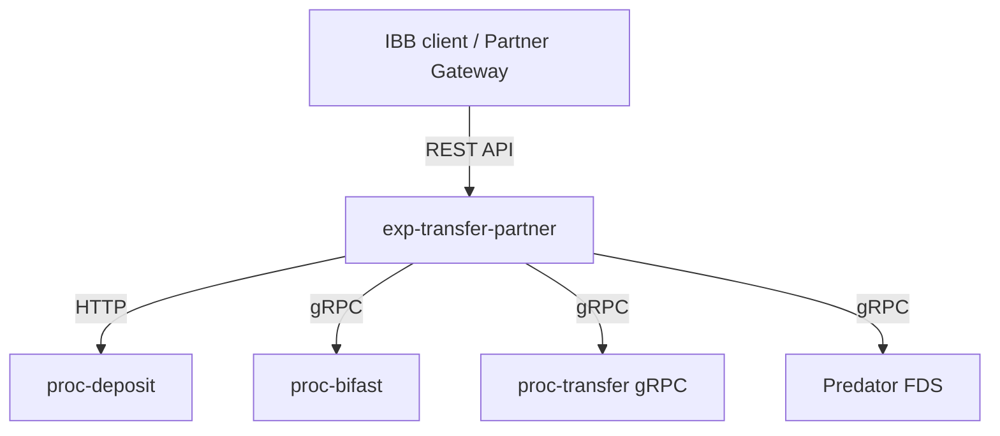
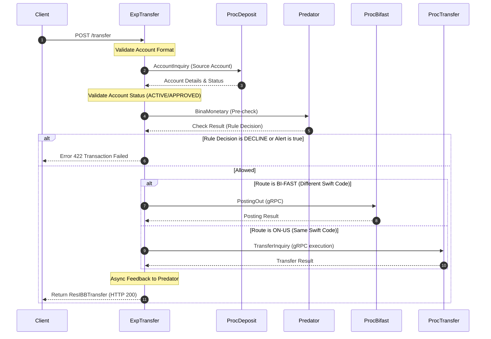

## IBB Transaction Endpoints Orchestration

### Document Metadata
* **System Name:** BI-FAST & Internal Transfer Integration
* **Service Layer:** Experience Layer (`exp-transfer-partner`)
* **Target Audience:** Frontend Developers, QA, Integration Engineers, Business Analysts
* **Author:** AI Coding Assistant
* **Date:** 2026-07-09
* **Status:** Draft

---

## 1. Overview & Architecture

The `exp-transfer-partner` service serves as the experience API layer for Internet Banking Business (IBB) transaction flows. It integrates with several downstream internal services to process account inquiries, transfers, and status validations:

* **Downstream Connections:**
  * **`proc-deposit` (HTTP):** Internal digital account validation, balance checks, and details retrieval.
  * **`proc-bifast` (gRPC / HTTP):** BI-FAST payment outbound gateway for inter-bank transaction inquiries, postings, and statuses.
  * **`proc-transfer` / `transfer-grpc` (gRPC):** Internal ledger transfer routing (ON-US transaction engine).
  * **`Predator` (FDS - Fraud Detection System via gRPC):** Real-time monetary/non-monetary event checking, rule evaluation, and transaction feedback mechanisms.



---

## 2. Common Configurations & Middlewares

All endpoints in this specification inherit standard middlewares attached to the `/v1/transaction-ibb` router group.

### 2.1 Route Prefixes
* **Base Prefix:** `/v1` (configured via `InternalRouting.V1.Prefix`)
* **Group Prefix:** `/transaction-ibb` (configured via `InternalRouting.V1.IbbTransaction.Prefix`)

### 2.2 Middleware Stack
The routing group is configured with three middlewares executing sequentially for every request:

1. **`OtelInController(tracer)`**
   * **Purpose:** Initializes an OpenTelemetry span for distributed tracing.
2. **`XTimestampMiddleware()`**
   * **Purpose:** Sets the `X-TIMESTAMP` header on the HTTP response with the current time in RFC3339 format (`YYYY-MM-DDTHH:MM:SSZ07:00`).
3. **`ValidateSymetricSignature()`**
   * **Purpose:** Ensures the payload authenticity and integrity using an HMAC512 signature.
   * **Calculation Logic:**
     * Minifies request body.
     * Grabs secret key from `SECRET_KEY_IBB` environment variable.
     * Extracts token component from the `Authorization` header.
     * Builds a string to sign using the pattern:
       ```
       StringToSign = HTTP_Method + "|" + URL_Without_Version + "|" + Authorization_Token + "|" + X-Timestamp + "|" + Minified_Body
       ```
     * Computes the HMAC512 checksum of `StringToSign` using `SECRET_KEY_IBB` and validates it against the incoming `X-Signature` header.
     * **Validation Failure:** Immediately aborts the connection with HTTP `401 Unauthorized` containing:
       ```json
       {
         "responseCode": 401,
         "responseMessage": "Unauthorized"
       }
       ```

### 2.3 Required Request Headers
For all endpoints (except where noted), the following headers are mandatory:

| Header Name | Type | Description |
| :--- | :--- | :--- |
| `Authorization` | String | Bearer token format |
| `X-Timestamp` | String | ISO 8601/RFC 3339 formatted request timestamp |
| `X-Signature` | String | Symmetric HMAC512 signature computed per Section 2.2 |

---

## 3. Endpoint Specifications

---

### 3.1 Account Inquiry Outbound (POST `/account-inquiry-out`)
This endpoint performs outbound account inquiry validations (primarily for BI-FAST) to confirm beneficiary account authenticity before making a transfer.

* **Path Configuration:** `InternalRouting.V1.IbbTransaction.Endpoint.AccountInquiryOut` (Defaults to `/`)
* **Full URL:** `/v1/transaction-ibb/account-inquiry-out` (as mapped in `config.json`)
* **HTTP Method:** `POST`

#### Request Payload (`dto.ReqAccountInquiryOut`)
```json
{
  "beneficiaryBankCode": "IAPTIDJA",
  "beneficiaryAccountNo": "987654321",
  "partnerReferenceNo": "PARTNER-REF-1002",
  "transactionPurpose": "99"
}
```

| Field Name | Type | Required | Description |
| :--- | :--- | :--- | :--- |
| `beneficiaryBankCode` | String | Yes | Swift or BI-FAST routing code of the receiving bank. |
| `beneficiaryAccountNo` | String | Yes | Account number of the receiver. |
| `partnerReferenceNo` | String | Yes | Unique transaction inquiry reference from the client. |
| `transactionPurpose` | String | No | BI-FAST transaction purpose code. Defaults to `"99"` if not provided. |

#### Response Payload (`dto.ResAccountInquiryOut`)
```json
{
  "responseCode": "0000000",
  "responseMessage": "Success",
  "beneficiaryAccountName": "JOHN SMITH",
  "beneficiaryAccountNo": "987654321",
  "beneficiaryAccountType": "SVGS",
  "beneficiaryBankCode": "IAPTIDJA",
  "beneficiaryBankName": "BANK CENTRAL ASIA",
  "beneficiaryNik": "3171012345678901",
  "partnerReferenceNo": "BIFAST-PARTNER-REF",
  "endToEndId": "INTERNAL-BIFAST-E2EID",
  "additionalInfo": {
    "meta": {
      "debugParam": "Inquiry completed",
      "traceId": "9b1deb4d-3b7d-4bad-9bdd-2b0d7b3d4bad"
    }
  }
}
```

#### Detailed Logical Flow
1. Retrieve standard `traceId` from request context.
2. Fallback to transaction purpose `"99"` if input is blank.
3. Generate reference identifiers:
   * Generate `bifastReferenceNumber` and `partnerReferenceNumber` using `helper.GenerateUniqueRefNumBIFAST(constant.TIPE_BIFAST_INQUIRY)`.
   * Generate `internalReferenceNumber` as a random 9-character string.
4. Route inquiry to downstream service `proc-bifast` via gRPC endpoint `AccountEnquiry`:
   * Metadata includes `trace-id`, `channel-id` (env `BIFAST_CHANNEL_ID`), `x-partner-id` (env `BIFAST_PARTNER_ID`), `x-external-id` (random UUID), and `source-channel-id` (env `BIFAST_SOURCE_CHANNEL_IBB` or `"IBBPARTNER"`).
   * Request structure contains charge bearer (`DEBT`), settlement method (`CLRG`), settlement method amount (`100` IDR test amount), receiver info, and source swift code hardcoded to PT Bank Ina (`SWIFTCODE_BANKINA`).
5. **Downstream Error Handling:** If `AccountEnquiry` returns an execution error, log the trace information and return HTTP `500 Internal Server Error`.
6. **FDS Monitoring (Asynchronous):**
   * Concurrently kick off a non-blocking non-monetary check via `Predator` gateway `BinaNonMonetary`.
   * Non-Monetary Event Code: `"14"` (Account Inquiry).
   * Downstream errors from Predator are logged but do not block or compromise the response.
7. Return HTTP `200 OK` mapping the `accountEnquiry` response fields into `dto.ResAccountInquiryOut`.

---

### 3.2 Account Inquiry Inbound / Internal (GET `/account/:id`)
Retrieves internal digital account details and balances.

* **Path Configuration:** `InternalRouting.V1.IbbTransaction.Endpoint.AccountInquiry` (Defaults to `/account/:id`)
* **Full URL:** `/v1/transaction-ibb/account/:id`
* **HTTP Method:** `GET`

#### Request Parameters
* **Path Parameter (`:id`):** Digital Account ID (String, Required).

#### Response Payload (`dto.ResAccountInquiry`)
```json
{
  "responseCode": "2001600",
  "responseMessage": "Successful",
  "customerNo": "1002345",
  "accountName": "ALICE IN WONDERLAND",
  "accountNo": "812345678901",
  "accountType": "SVGS",
  "accountStatus": "ACTIVE",
  "nik": "3273012345670001",
  "availableBalance": 25000000.50,
  "additionalInfo": {
    "meta": {
      "debugParam": "Active customer account",
      "traceId": "9b1deb4d-3b7d-4bad-9bdd-2b0d7b3d4bad"
    }
  }
}
```

#### Detailed Logical Flow
1. Extract `traceId` from context.
2. Validate path parameter `:id`. If blank, return HTTP `400 Bad Request`.
3. Invoke `AccountInquiry` REST call to `proc-deposit` (configured endpoint `/v1/deposits/{id}`):
   * Send HTTP request headers `trace-id`, `channel-id`, and `source-channel-id`.
4. **Downstream Error Handling:** If the HTTP request returns an error or fails, log the failure and return HTTP `502 Bad Gateway`.
5. Resolve fields from the payload structure:
   * **Account Status:** Retrieved from `Deposit.Status`. If blank, fall back to `Deposit.AccountState`.
   * **Customer Number:** Parsed from root `UserID` or `Deposit.UserID` and converted to string.
6. **FDS Monitoring (Asynchronous):**
   * Trigger the asynchronous Predator Non-Monetary logging function `BinaNonMonetary` with Event Code `"14"` and a timeout ceiling of 120 seconds.
7. Return HTTP `200 OK` mapping all output values to `dto.ResAccountInquiry` with fixed response code `"2001600"` and message `"Successful"`.

---

### 3.3 Transfer Status Check (POST `/transfer/status`)
Checks the processing status of a historical transfer. Supports both internal/on-us transactions and inter-bank BI-FAST transactions.

* **Path Configuration:** `InternalRouting.V1.IbbTransaction.Endpoint.Status` (Defaults to `/transfer/status`)
* **Full URL:** `/v1/transaction-ibb/transfer/status`
* **HTTP Method:** `POST`

#### Request Payload (`dto.ReqTransferStatus`)
```json
{
  "originalPartnerReferenceNo": "PARTNER-REF-1003",
  "originalReferenceNo": "TRF-909282312",
  "endToEndId": "20260206IAPTIDJA510O0113826412",
  "transactionType": "BIFAST",
  "terminalId": "01"
}
```

| Field Name | Type | Required | Description |
| :--- | :--- | :--- | :--- |
| `originalPartnerReferenceNo` | String | Yes | The reference number initially supplied by the partner client. |
| `originalReferenceNo` | String | Yes | Downstream internal core reference number. |
| `endToEndId` | String | Yes | End-to-end unique ID generated at transfer execution. |
| `transactionType` | String | Yes | Either `"BIFAST"` or `"ONUS"`. (Case-insensitive) |
| `terminalId` | String | No | Identifier of the originating terminal. |

#### Response Payload (`dto.ResTransferStatus`)
```json
{
  "responseCode": "2003600",
  "responseMessage": "Successful",
  "originalPartnerReferenceNo": "PARTNER-REF-1003",
  "originalReferenceNo": "TRF-909282312",
  "originalExternalID": "E2E-98716",
  "transactionDate": "2026-07-09T14:33:00Z",
  "amount": "500000.00",
  "currency": "IDR",
  "beneficiaryAccountNo": "987654321",
  "beneficiaryBankCode": "IAPTIDJA",
  "referenceNumber": "REF-8716",
  "sourceAccountNo": "812345678901",
  "latestTransactionStatus": "00",
  "transactionStatusDesc": "Success",
  "notes": "Transfer notes",
  "additionalInfo": {
    "meta": {
      "debugParam": "",
      "traceId": "9b1deb4d-3b7d-4bad-9bdd-2b0d7b3d4bad"
    }
  }
}
```

#### Detailed Logical Flow
1. Validate required fields (`originalPartnerReferenceNo`, `endToEndId`, `transactionType`). Fail with HTTP `400 Bad Request` if validations fail.
2. Sanitize and uppercase `transactionType`.
3. **Route A: ON-US Transactions**
   * Trigger POST request to internal transfer HTTP service `u.transfer.Status` (`/v1/status`) sending payload containing the `originalPartnerReferenceNo`.
   * If error, return HTTP `502 Bad Gateway`.
   * Return HTTP `200 OK` containing mapped outputs.
4. **Route B: BI-FAST Transactions**
   * Call `TransactionStatus` gRPC function of the `proc-bifast` service.
   * Key parameters: `References.Partner` = `req.EndToEndID`, `References.Internal` = `req.OriginalReferenceNo`.
   * **Response Code Translation:** Checks response code header. Extract the first 3 characters and parse as integer (e.g. `"2001800"` -> `200`) to derive the HTTP response code.
   * Parse status codes: `StatusCodeBi` maps to `latestTransactionStatus`, `ReasonCodeBi` maps to `transactionStatusDesc`.
   * If no specific codes exist, default to success `"00"`/`"Success"`, with fixed status response code `"2003600"` and message `"Successful"`.

---

### 3.4 Transfer Outbound Execution (POST `/transfer`)
Orchestrates and executes an outbound money transfer. Automatically routes the transaction flow dynamically based on the beneficiary bank code (On-Us vs inter-bank BI-FAST).

* **Path Configuration:** `InternalRouting.V1.IbbTransaction.Endpoint.Transfer` (Defaults to `/transfer`)
* **Full URL:** `/v1/transaction-ibb/transfer`
* **HTTP Method:** `POST`

#### Request Payload (`dto.ReqIBBTransfer`)
```json
{
  "partnerReferenceNo": "PARTNER-REF-5001",
  "amount": "150000.00",
  "currency": "IDR",
  "transactionType": "BIFAST",
  "beneficiaryAccountName": "SARAH JENKINS",
  "beneficiaryAccountNo": "100299933",
  "beneficiaryBankCode": "CENAIDJA",
  "beneficiaryNik": "3171098765432109",
  "sourceAccountNo": "812345678901",
  "transactionDate": "2026-07-09T14:33:00Z",
  "transactionPurpose": "01",
  "notes": "Monthly allowance",
  "feeAmount": "2500.00"
}
```

| Field Name | Type | Required | Description |
| :--- | :--- | :--- | :--- |
| `partnerReferenceNo` | String | Yes | Client reference number. |
| `amount` | String | Yes | Transaction amount to be debited. |
| `currency` | String | Yes | Currency code (must match source account currency). |
| `transactionType` | String | Yes | `"BIFAST"` or `"ONUS"`. |
| `beneficiaryAccountName`| String | Yes | Receiving account name. |
| `beneficiaryAccountNo` | String | Yes | Receiving account identifier. |
| `beneficiaryBankCode` | String | Yes | Downstream swift/routing code of beneficiary bank. |
| `beneficiaryNik` | String | No | Beneficiary Identity Number (NIK) for additional screening. |
| `sourceAccountNo` | String | Yes | Internally debited digital account number. |
| `transactionDate` | String | Yes | Timestamp of transaction initiation. |
| `transactionPurpose` | String | Yes | BI-FAST transaction purpose category code. |
| `notes` | String | No | Free-form transaction narration. |
| `feeAmount` | String | No | Computed transfer fee to debit from source. |

#### Response Payload (`dto.ResIBBTransfer`)
```json
{
  "responseCode": "2001800",
  "responseMessage": "Successful",
  "referenceNo": "TXN-BIFAST-82739",
  "partnerReferenceNo": "PARTNER-REF-5001",
  "amount": "150000.00",
  "currency": "IDR",
  "beneficiaryAccountName": "SARAH JENKINS",
  "beneficiaryAccountNo": "100299933",
  "beneficiaryBankCode": "CENAIDJA",
  "beneficiaryBankName": "BANK CENTRAL ASIA",
  "sourceAccountNo": "812345678901",
  "sourceAccountName": "ALICE IN WONDERLAND",
  "notes": "Monthly allowance",
  "transactionDate": "2026-07-09T14:33:00Z",
  "feeAmount": "2500.00",
  "endToEndId": "E2E-BIFAST-82739",
  "additionalInfo": {
    "meta": {
      "traceId": "9b1deb4d-3b7d-4bad-9bdd-2b0d7b3d4bad"
    }
  }
}
```

#### Detailed Logical Flow



1. **Digital Account Format Check:**
   * Validates if `req.SourceAccountNo` has exactly 12 digits, or 14 digits prefixing with `"81"`.
   * **Failure:** Returns mapped error response (`CASE_CODE_NOT_FOUND`, `MESSAGE_INVALID_ACCOUNT`, "Source account is not a digital account") with HTTP `404 Not Found`.
2. **Retrieve Source Account Details:**
   * Calls `AccountInquiry` REST API of `proc-deposit`.
   * **Failure:** If connection to deposit service errors out, returns HTTP `502 Bad Gateway` with mapped code `CASE_CODE_TIMEOUT`.
3. **Verify Account Transaction Status Eligibility:**
   * Ensures status (retrieved from `Deposit.Status` or `Deposit.AccountState`) is `"APPROVED"` or `"ACTIVE"`.
   * **Failure:** Return HTTP `404 Not Found` with code `CASE_CODE_NOT_FOUND` / message `"Transaction not found"`.
4. **Anti-Fraud (Predator FDS Monetary Pre-Check):**
   * Calls `Predator` gateway function `BinaMonetary` with request information.
   * If call errors out, fail with HTTP `502 Bad Gateway`.
   * Evaluates validation response flags. If `Alert` is true or `RuleDecision` is `"DECLINE"`, block transaction execution and return HTTP `422 Unprocessable Entity` with error structure mapping to `MESSAGE_TRANSACTION_FAILED`.
5. **Route Evaluation:**
   * Evaluates if `req.BeneficiaryBankCode` matches `bifast_constant.SWIFTCODE_BANKINA` (meaning internal Bank Ina transfer/ON-US) or is different (inter-bank BI-FAST).
6. **Route A: BI-FAST Outbound Execution**
   * Generate `bifastRef` using `helper.GenerateUniqueRefNumBIFAST`.
   * Construct `internalID` (shortened `bifastRef` string format).
   * Construct `transactionPurpose` formatted as: `"010"` + `req.TransactionPurpose`.
   * Invoke `PostingOut` gRPC method on `proc-bifast`.
   * Evaluates response. If the first 3 characters of `ResponseCode` represent an error status (not 200), bubble up the response error.
7. **Route B: ON-US Internal Outbound Execution**
   * Call gRPC endpoint `u.transferGrpcGateway.TransferInquiry` (which handles the database entries/ledger transfers internally for Bank Ina).
   * Extract ledger-allocated transaction reference `onUsResp.Data.ReferenceNo`.
8. **Feedback Submission (Asynchronous):**
   * Spawns a concurrent go-routine to invoke Predator gateway `FeedBack` function asynchronously with a 120-second deadline.
   * Success feedback code: `"1"` (if transfer successful), `"0"` (if transfer failed).
9. Return output mapped to `dto.ResIBBTransfer` with HTTP `200 OK` and general response code `"2001800"`.

---

## 4. Key Error & Status Mappings

Below is the translation table of the primary error codes returned by the service:

| Downstream/Internal Case Code | HTTP Response Code | Message String (`responseMessage`) | Narrative Reason |
| :--- | :--- | :--- | :--- |
| `00` | 200 (or custom) | `Successful` | Operation completed successfully. |
| `01` | 500 / 502 / 400 | `Internal server error` | Core down, network interface errors, or internal service panic. |
| `01` | 400 | `Duplicate partnerReferenceNo` | Same partner reference sent multiple times. |
| `02` | 502 | `Invalid Customer Token` | Security token check for downstream customer failed. |
| `03` | 422 | `Suspected Fraud` | FDS Predator blocked transaction as suspicious. |
| `06` | 400 | `Feature Not Allowed At This Time` | Feature is currently in a scheduled cut-off period. |
| `09` | 400 | `Dormant Account` | Source digital account is in a dormant state. |
| `11` | 404 | `Invalid Account` | Target/beneficiary account was not found. |
| `11` | 404 | `Transaction not found` | Transaction details requested do not exist in storage. |
| `13` | 400 | `Invalid amount` | Badly structured numerical format in amount field. |
| `14` | 400 | `Insufficient Fund` | Request amount exceeds available digital balances. |
| `18` | 400 | `Inactive account` | Source digital account is closed or not active. |
| `23` | 400 | `Account Limit Exceed` | Transaction value exceeds daily or per-txn account limits. |
